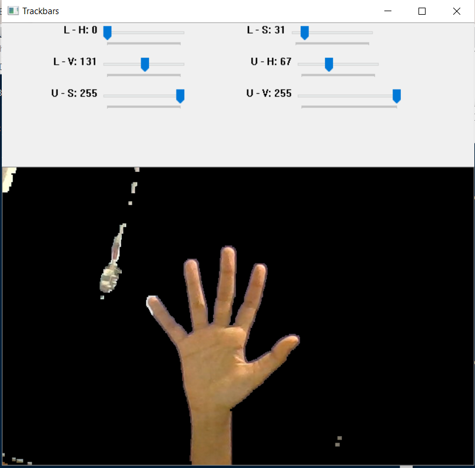
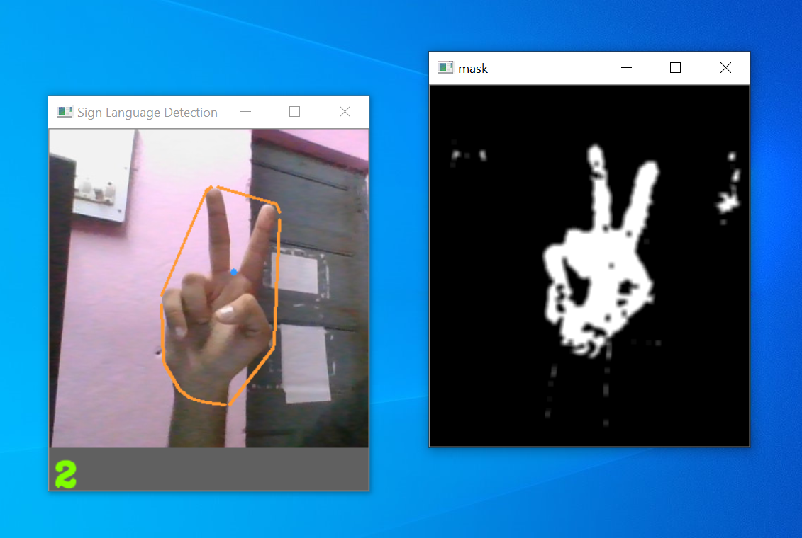
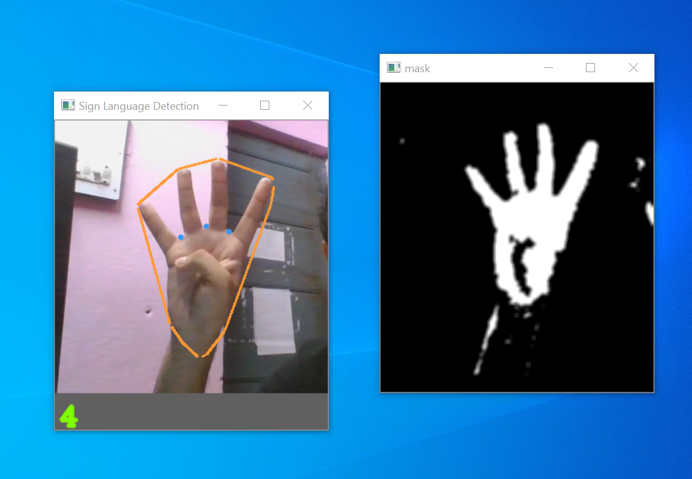
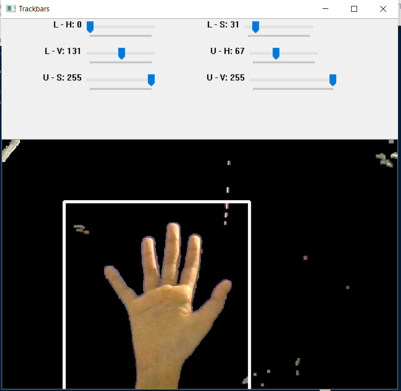
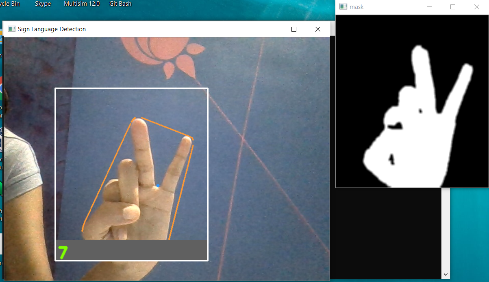
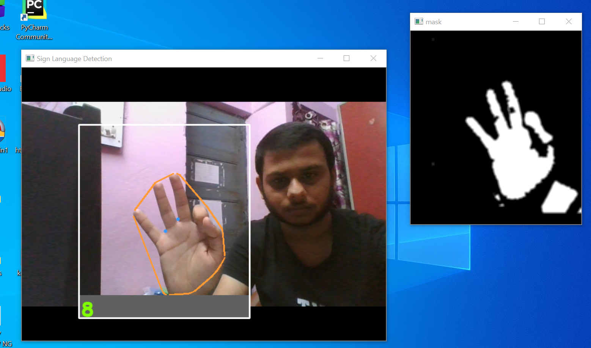

# Sign Language Detection (Computer Vision Task - IV Labs)
*Contributers : Diksha Bagade, Nikhil Yadav, Aadarsh Kothari*
___
The repository contains the following codes:  
**1. Sign language Detection (Left Hand)** - This was the initial code, which works only for the left hand.  
**2. Sign language Detection** - It's the modified version of the code above, which works for both hands.
___
  
**Both the codes run on the following gestures***  

___

## Steps to run each code :  
  
### **Sign Language Detection (Left Hand)**   
  
*STEP 1* : The first window u'll get would have trackbars to adjust and input upper and lower HSV values for creating the mask of your hand. When you are done with creating the mask, press **Enter**   

  

*STEP 2* : Place your hand in the defined box, and proceed. Press **q** to quit  
  
  
 
  
### **Sign Language Detction**  
  
*STEP 1* : When you run the code, you'll see a white box on the screen. Adjust the upper and lower HSV values using trackbars to get mask of your hand and then place your hand inside the white rectangle. Make sure your hand **makes a sign of 5 while placing it in the box.** 
  
  

*STEP 2* : Press **Enter**, while keeping ur hand inside the box. The code will then detect wheather it's a right hand or a left, and give results accordingly.  

*STEP 3* : Place your hand in the rectangle you see, and proceed  
  
  
  

